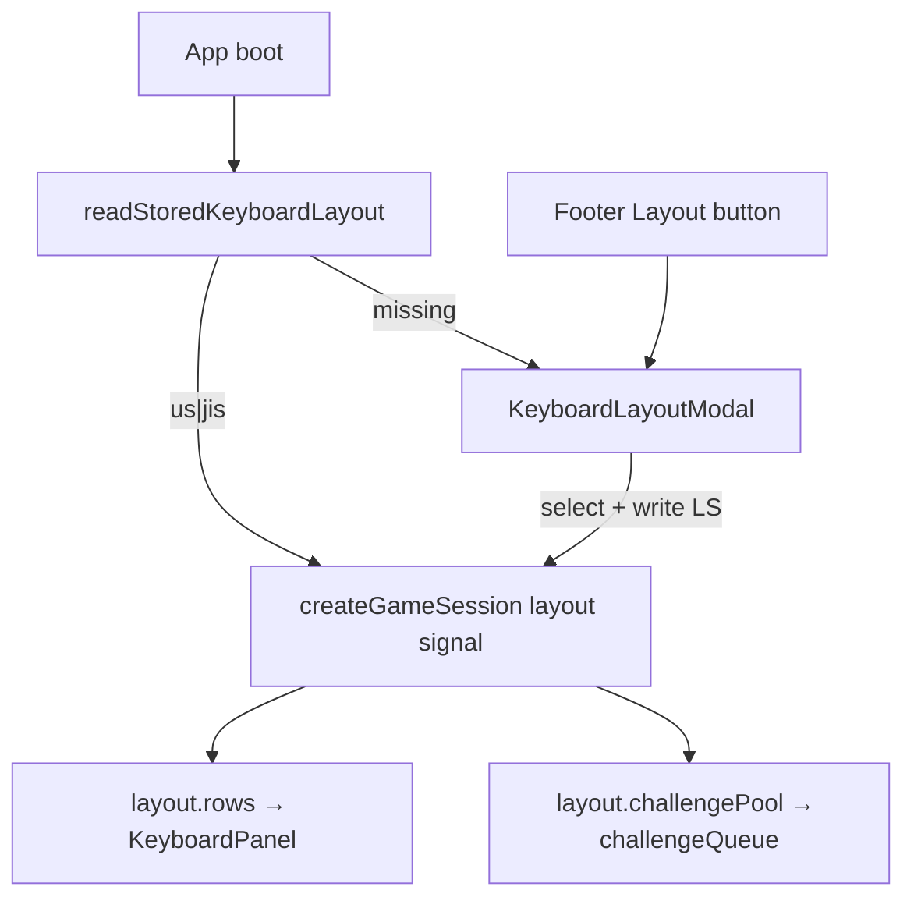

# Multi-keyboard layout (US + Japanese)

## Scope decisions

- Layouts: **US QWERTY** + **Japanese (JIS)** only
- First visit: no `shot-key:keyboard-layout` → centered modal (must pick one; no dismiss without choice)
- Anytime: footer **Layout** button reopens the same modal
- Judging stays `event.key === challenge.character` (already layout-agnostic); only `base`/`shifted`/`keyId`/`requiresShift` change per layout
- `character-stats` stays character-keyed (shared across layouts); layout change calls `resetGame()` to rebuild the queue
- **All visible UI strings → English** (labels, aria-labels, feedback details). Korean **code comments** stay as-is per project standards

## Architecture



## 1. Layout data model

[`src/game/types.ts`](src/game/types.ts)

```ts
export type KeyboardLayoutId = "us" | "jis";
```

Refactor [`src/game/keyboardLayout.ts`](src/game/keyboardLayout.ts) (or split `us.ts` / `jis.ts` under `src/game/layouts/`):

- Keep current rows as **US**
- Add **JIS** rows with Windows JP symbol map (training-relevant char keys only):

| `code` / id | US | JIS |
|---|---|---|
| `digit-2` | 2/@ | 2/" |
| `digit-6`..`digit-0` | US symbols | 6/& 7/' 8/( 9/) 0/~ |
| `minus` | -/_ | -/= |
| `equal` | =/+ | ^/~ |
| `bracket-left` | [/{ | @/\` |
| `bracket-right` | ]/} | [/{ |
| `backslash` | \\/\| | ]/} |
| `intl-ro` (JIS only) | — | \\/\| |
| `semicolon` | ;/: | ;/+ |
| `quote` | '/" | :/* |
| `backquote` | \`/~ | omit as char (Hankaku/Zenkaku — not in challenge pool) |

- Export registry API:
  - `keyboardLayouts: Record<KeyboardLayoutId, { id, label, rows }>`
  - `getKeyboardRows(id)`, `getKeyboardKeyMap(id)`, `getChallengePool(id)`, `getChallengePoolsByGroup(id)`
  - Extend `getKeyboardEventKeyId` with `IntlRo → "intl-ro"`
- Deprecate module-level static `keyboardRows` / `challengePool` exports; callers take layout id

[`src/game/challengeQueue.ts`](src/game/challengeQueue.ts): accept `challengePool` / group pools as args (or layout id) instead of importing a single global pool.

## 2. Persistence

[`src/game/constants.ts`](src/game/constants.ts)

- `keyboardLayoutStorageKey = "shot-key:keyboard-layout"`
- `keyboardLayoutOptions = [{ id: "us", label: "US QWERTY" }, { id: "jis", label: "Japanese" }]`

[`src/storage/persistence.ts`](src/storage/persistence.ts)

- `readStoredKeyboardLayout(): KeyboardLayoutId | null` — invalid/missing → `null` (triggers modal)
- write via existing `writeStoredValue`

Update [`docs/reference/storage-keys.md`](docs/reference/storage-keys.md).

## 3. Session wiring

[`src/hooks/createGameSession.ts`](src/hooks/createGameSession.ts)

- `keyboardLayout` signal (nullable until chosen, or separate `layoutReady`)
- Derived: `keyboardRows`, `keyboardKeyMap`, `challengePool` from layout
- `setKeyboardLayout(id)`: persist, update signal, `resetGame()` so queue/hints match new symbols
- `keyboardShiftKeyId` / flash / risk map use layout-scoped `keyboardKeyMap`
- Replace Korean feedback strings with English (e.g. `"Type the character shown"`, `"Gauge depleted"`, miss lock detail)

[`src/components/KeyboardPanel.tsx`](src/components/KeyboardPanel.tsx): take `rows: Accessor<KeyboardKey[][]>` instead of importing static `keyboardRows`.

## 4. Layout modal + footer button

New [`src/components/KeyboardLayoutModal.tsx`](src/components/KeyboardLayoutModal.tsx)

- Full-screen dim overlay, centered card
- Title: `Select keyboard layout`
- Horizontal options: mini key-row preview or label cards for **US QWERTY** / **Japanese**
- Click → `setKeyboardLayout` + close
- First-run: block interaction with game until selected (`Show when={!layout}`)
- Reopen from footer: allow close via selecting (same as first-run) or Esc/backdrop only when layout already set

[`src/components/GameFooter.tsx`](src/components/GameFooter.tsx)

- Add **Layout** button in Keyboard settings group → `onOpenLayoutModal`
- Convert all footer labels to English: Mode, Endless, Feedback, Sound, Visual, Keyboard, Panel, Guide, Flash, Font, Restart

[`src/App.tsx`](src/App.tsx): own `layoutModalOpen` signal; open when stored layout is `null` on mount, or when footer requests.

## 5. English UI pass (visible strings)

| Area | Examples |
|------|----------|
| ChallengeCard HUD | Best / Score / Streak / Survival / Most missed / Session / Left·Right accuracy |
| BuildMeta | Changelog; theme aria-labels |
| modeOptions | All / Left / Right + English descriptions |
| formatting | `Left` / `Right` instead of 왼손/오른손 |
| KeyboardPanel aria | `Keyboard` |

Judgment labels (`PERFECT`/`GOOD`/…) already English — leave as-is.

## 6. Docs (minimal)

- [`docs/reference/storage-keys.md`](docs/reference/storage-keys.md) — new key
- [`docs/reference/gameplay-rules.md`](docs/reference/gameplay-rules.md) — note US/JIS layout selection
- [`CHANGELOG.md`](CHANGELOG.md) `[Unreleased]` — Added keyboard layouts + English UI

## 7. Verify

- `npm run lint && npm run build`
- Manual: clear LS → modal → pick Japanese → panel shows `@` on `[` key position, typing `@` without Shift scores; switch to US via Layout button → `@` requires Shift+2; flash/`IntlRo` on JIS `\` key
