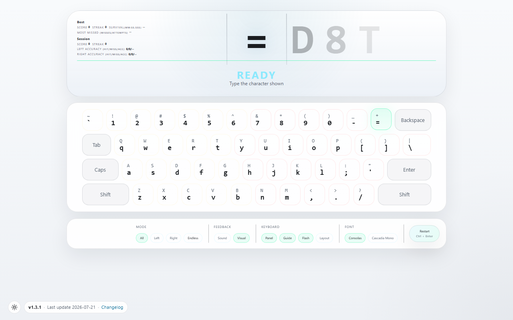
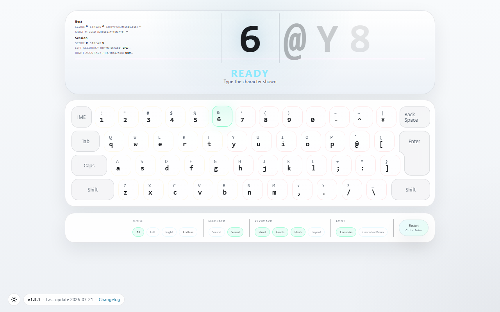
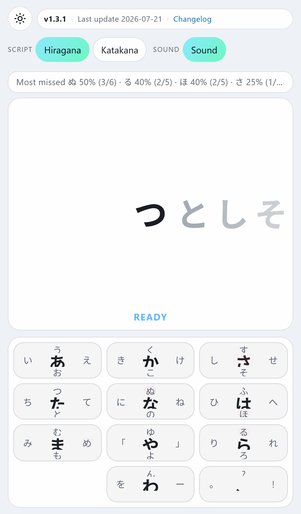

# ShotKey

Browser typing trainer for US QWERTY, Japanese JIS, and mobile Japanese kana flick practice.

## Live Demo

https://noelfania.github.io/shotKey/

## Features

- **US QWERTY** desktop practice driven only by `keydown` (no text field)
- **Japanese JIS** layout with an L-shaped Enter keycap
- **Mobile Japanese kana flick** minigame for hiragana / katakana (on-screen 10-key pad)
- Judgment feedback (PERFECT · GOOD · OK · MISS · TIME OUT on desktop; HIT / MISS on kana)
- Local-only character stats, weak-key highlighting, themes, and settings (`localStorage`)
- No accounts, no server, no database

## Screenshots

### US QWERTY (desktop)



### Japanese JIS (desktop)



### Mobile kana flick



## Development

```bash
npm install
npm run dev
```

- Force desktop mode: `http://localhost:34567/shotKey/?mode=pc`
- Force kana mode: `http://localhost:34567/shotKey/?mode=kana`

See [docs/development/local-setup.md](docs/development/local-setup.md).

## Documentation

- [docs/README.md](docs/README.md) — documentation map
- [CHANGELOG.md](CHANGELOG.md) — release history
- [docs/reference/gameplay-rules.md](docs/reference/gameplay-rules.md) — desktop rules
- [docs/reference/kana-minigame-rules.md](docs/reference/kana-minigame-rules.md) — mobile kana rules
