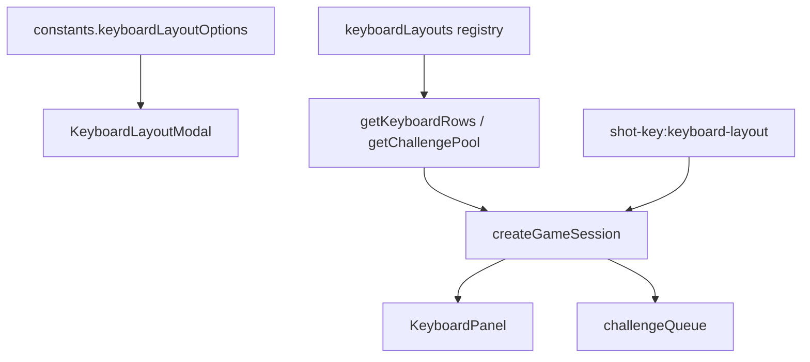

# 키보드 레이아웃 확장 가이드

향후 US/JIS 외 레이아웃(예: German, UK, Korean 물리 배열)을 추가할 때 참고하는 **구조·절차·한계** 문서입니다.

현재 지원: **US QWERTY**, **Japanese (JIS)**. 플레이 규칙은 [gameplay-rules.md](gameplay-rules.md), storage 키는 [storage-keys.md](storage-keys.md).

## 설계 요약

레이아웃은 **레지스트리 + id 조회** 패턴으로 묶여 있습니다. 게임 로직·UI는 특정 레이아웃에 하드코딩된 분기(`if (jis)`) 없이 `KeyboardLayoutId`만 전달받습니다.

| 계층 | 역할 |
|------|------|
| `KeyboardLayoutId` + `keyboardLayouts` | 레이아웃 id → rows·label 정의 |
| `getKeyboardRows` / `getChallengePool` / … | id로 패널·출제 풀·키맵 조회 |
| `challengeQueue` | 전역 풀 import 없이 `layoutId`로 후보 풀 선택 |
| `createGameSession` | `keyboardLayout` signal, 변경 시 `resetGame()` |
| `KeyboardLayoutModal` | `keyboardLayoutOptions`를 `For`로 렌더 → 옵션만 늘리면 UI 반영 |
| 판정 | `event.key === challenge.character` (레이아웃별 `base`/`shifted`만 다름) |

## 확장에 열린 부분

- **출제·재출제**: `challengeQueue`의 모든 함수가 `layoutId` 인자를 받음 → 새 레이아웃 rows만 맞으면 큐 알고리즘 재사용.
- **온스크린 키보드**: `KeyboardPanel`은 `rows` accessor만 받음 → 레이아웃 데이터 교체만으로 패널 갱신.
- **키캡 반짝·힌트**: `getKeyboardEventKeyId(event.code)` → 물리 키 id; 레이아웃별 `keyId`와 매칭.
- **설정 UI**: 모달·푸터 Layout 버튼은 `keyboardLayoutOptions` 배열 기준 → label/id 추가로 노출.
- **저장**: `shot-key:keyboard-layout`에 id 문자열만 저장; `readStoredKeyboardLayout()`이 validator로 검증.

## 새 레이아웃 추가 체크리스트

예: `de` (German QWERTZ) 추가 시.

### 1. 타입·상수

1. [`src/game/types.ts`](../../src/game/types.ts) — `KeyboardLayoutId`에 `"de"` 추가.
2. [`src/game/constants.ts`](../../src/game/constants.ts) — `keyboardLayoutOptions`에 `{ id: "de", label: "German" }` 추가.

### 2. 레이아웃 데이터

3. [`src/game/keyboardLayout.ts`](../../src/game/keyboardLayout.ts):
   - `deKeyboardRows: KeyboardKey[][]` 정의 (`base` / `shifted` / `hand` / `helperShiftKeyId` / `widthUnits`).
   - `keyboardLayouts` 레지스트리에 `{ id: "de", label: "German", rows: deKeyboardRows }` 등록.
   - `layoutCache`는 `keyboardLayouts` 키를 순회해 자동 생성되므로 **별도 수정 불필요**.

**권장:** 레이아웃이 3개 이상이면 `src/game/layouts/us.ts`, `layouts/jis.ts`, `layouts/de.ts`로 파일 분리 후 `keyboardLayout.ts`는 레지스트리·getter만 유지.

### 3. 물리 키 매핑 (필요 시)

4. 같은 `KeyboardEvent.code`를 쓰는 레이아웃이면 `getKeyboardEventKeyId` 변경 없음.
5. JIS 전용처럼 **새 물리 키**가 있으면 `getKeyboardEventKeyId`의 `keyboardEventCodeMap`에 추가 (예: `IntlRo` → `"intl-ro"`).

### 4. char 키 규칙

- `kind: "char"`인 키만 챌린지 풀에 포함 (`buildChallengePool`).
- IME 전환·한/영·変換 등 **action 키**는 `kind: "action"`으로 두고 풀에서 제외.
- `backquote` 등 레이아웃마다 훈련 대상이 아닌 키는 action으로 두는 것이 안전 (JIS IME 키 참고).
- 특수 키캡 외형(예: JIS L자 Enter)은 `shape: "jis-enter"` + 홈행 `jis-enter-slot` + 고정 `--key-u`로 열 정렬.

### 5. 검증

6. `npm run lint && npm run build`
7. 수동: 모달에 새 옵션 표시 → 선택 후 패널 기호·출제 문자·`event.key` 판정 일치 확인.
8. [`docs/reference/storage-keys.md`](storage-keys.md) — `shot-key:keyboard-layout` 허용 값 목록에 id 추가 (문서만).

**수정 불필요한 파일 (일반적):** `KeyboardPanel.tsx`, `KeyboardLayoutModal.tsx`, `GameFooter.tsx`, `challengeQueue.ts` 알고리즘, `App.tsx` wiring.

## 판정·입력 모델

- 정답 조건: `pressedKey === currentChallenge.character` (`createGameSession` keydown 핸들러).
- `requiresShift`는 **UI 힌트**(어느 Shift 키를 밝출지)용; 판정은 `event.key` 문자열 일치만 사용.
- 따라서 레이아웃 추가 시 **각 키의 `base`/`shifted`가 OS에서 실제 나오는 `event.key`와 일치**해야 함 (브라우저·OS 조합별로 한 번 실측 권장).

## 한계·비범위

| 항목 | 설명 |
|------|------|
| IME / 조합 입력 | 한글·일본어 **문자 조합 입력**은 미지원. 단일 `keydown`의 `event.key` 한 글자만 판정. |
| 레이아웃별 통계 분리 | `character-stats`는 문자 기준 공유. 레이아웃 전환 시 `resetGame()`으로 큐만 재생성; 통계는 유지. |
| 유니온 타입 | `KeyboardLayoutId`에 id를 추가할 때마다 TypeScript 수정 필요 (의도된 타입 안전). |
| 단일 대형 파일 | rows가 `keyboardLayout.ts` 한 파일에 있으면 유지보수 부담 → `layouts/` 분리 권장. |
| AZERTY 등 물리 배열 | 알파벳 위치가 다른 레이아웃은 **rows 전체**를 새로 정의해야 함 (기호만 다른 JIS보다 작업량 큼). |

## 관련 소스

| 파일 | 내용 |
|------|------|
| [`src/game/keyboardLayout.ts`](../../src/game/keyboardLayout.ts) | US/JIS rows, 레지스트리, getter, `getKeyboardEventKeyId` |
| [`src/game/types.ts`](../../src/game/types.ts) | `KeyboardLayoutId`, `KeyboardLayoutDefinition`, `KeyboardKey` |
| [`src/game/constants.ts`](../../src/game/constants.ts) | `keyboardLayoutStorageKey`, `keyboardLayoutOptions` |
| [`src/storage/persistence.ts`](../../src/storage/persistence.ts) | `readStoredKeyboardLayout` |
| [`src/hooks/createGameSession.ts`](../../src/hooks/createGameSession.ts) | `keyboardLayout` signal, `setKeyboardLayout`, layout-scoped pool |
| [`src/components/KeyboardLayoutModal.tsx`](../../src/components/KeyboardLayoutModal.tsx) | 첫 방문·재선택 모달 |

## 관련 문서

- [gameplay-rules.md](gameplay-rules.md) — 플레이어 관점 레이아웃 규칙
- [architecture.md](architecture.md) — `src/` 모듈 맵
- [storage-keys.md](storage-keys.md) — `shot-key:keyboard-layout`
